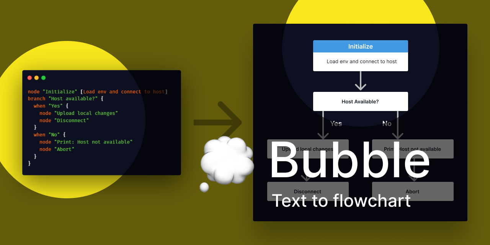

# Bubble

💭 Bubble is an experimental text to flowchart language.

This project is part of [#CreateWeekly](https://dev.to/josephuspaye/createweekly-create-something-new-publicly-every-week-in-2020-1nh9), my attempt to create something new publicly every week in 2020.

## Delivered in parts

- The first part, delivered in Week 6, is the [language grammar](lib/src/peg/bubble.pegjs) and [corresponding parser](lib/src/peg/generated-parser.js).
- The second part, delivered in Week 7, is the [semantic analyser](lib/src/analyser.ts) and [basic editor](editor/).

## Contributing

See [contribution guide](CONTRIBUTING.md).

## To-Do

- [x] Add a basic editor for testing the parser
- [x] Part 2: Semantic Analysis of AST
- [ ] Add Monaco editor with syntax highlighting and inline errors/warnings
- [ ] Part 3: Style resolution and inital code generation

## Licence

[MIT](LICENCE)
